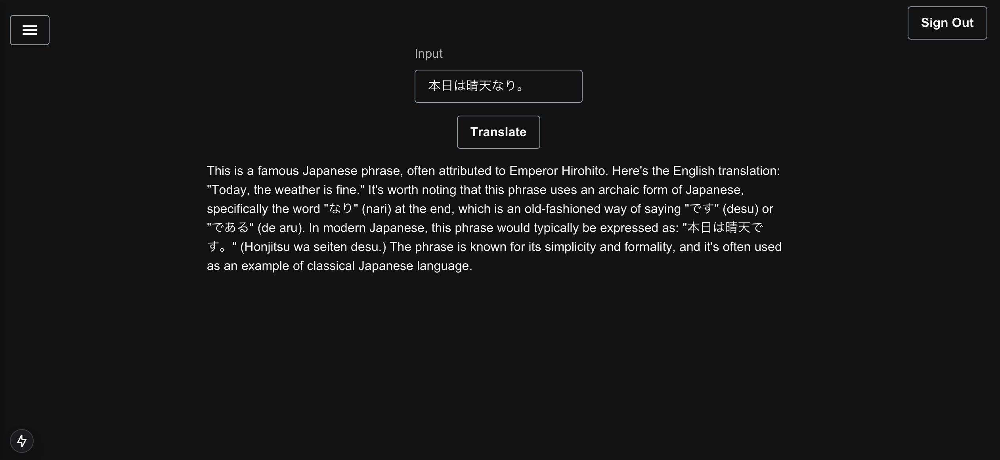

# AWS Amplify Gen 2: Python Custom Lambda Function Application

This project demonstrates how to integrate a Python runtime custom Lambda function into an AWS Amplify Gen 2 application. Built with Next.js using the App Router, the project highlights seamless interaction with the backend via Amplify’s generated API client. It includes a user-friendly interface for making API calls and displaying responses. See [AWS Amplify Gen 2](https://docs.amplify.aws/nextjs/build-a-backend/functions/custom-functions/) for more information.


---

## How to Integrate a Python Runtime Custom Lambda Function into an AWS Amplify Gen 2 Application

### 1. Create a New Next.js Project

> Reference: https://nextjs.org/docs/app/getting-started/installation#automatic-installation

Open your terminal and create a new Next.js project with the following command:

```bash
npx create-next-app@latest
```

When prompted, configure your project settings:

```bash
✔ What is your project named? … amplify-gen2-account-settings
✔ Would you like to use TypeScript? … No / Yes
✔ Would you like to use ESLint? … No / Yes
✔ Would you like to use Tailwind CSS? … No / Yes
✔ Would you like your code inside a `src/` directory? … No / Yes
✔ Would you like to use App Router? (recommended) … No / Yes
✔ Would you like to use Turbopack for `next dev`? … No / Yes
✔ Would you like to customize the import alias (`@/*` by default)? … No / Yes
```

Navigate to the project directory:

```bash
cd amplify-gen2-account-settings
```

Start the development server:

```bash
npm run dev
```

Visit [http://localhost:3000](http://localhost:3000/) in your browser to view the application.

---

### 2. Install Amplify Gen 2

> Reference: https://docs.amplify.aws/react/start/manual-installation/

Install Amplify in your project folder:

```bash
npm create amplify@latest
? Where should we create your project? (.) # press enter
```

The `amplify` folder will be created in the project directory, containing the following structure:

```
amplify/
├── auth/
│   └── resource.ts
├── data/
│   └── resource.ts
├── backend.ts
├── tsconfig.json
└── package.json
```

Deploy the cloud sandbox in a new terminal tab:

```bash
npx ampx sandbox
```

This will automatically generate the `amplify_outputs.json` file and create the required AWS components. This process may take a few minutes.

---

### 3. Install Required Packages

> Reference: https://ui.docs.amplify.aws/react/getting-started/installation

Install the necessary dependencies:

```bash
npm install @aws-amplify/ui-react aws-amplify react-icons
```

---

### 4. Create a Custom Lambda Function

1. In the `amplify/functions/` directory, create a folder named `say-hello`.
2. Add the following files:
    - `functions/say-hello/resource.ts`
    - `functions/say-hello/handler.py`
3. Ensure the `runtime` in `resource.ts` is set to Python.
4. Use `handler` as the function name (not `lambda-handler` or others).
5. Handle arguments via `event.arguments` in the handler function.

Example `schema` configuration in `amplify/data/resource.ts`:

```typescript
const schema = a.schema({
    sayHello: a
        .query() // Defines the query operation
        .arguments({ name: a.string() }) // Expects a "name" argument of type string
        .returns(a.json()) // Returns a JSON response
        .handler(a.handler.function(sayHelloFunctionHandler)) // Maps to the Lambda function handler
        .authorization((allow) => [allow.publicApiKey()]), // Allows public API key access
});
```

---

### 5. Use the Function in the Frontend

To use the custom function in your frontend, import the schema and outputs:

```typescript
import type { Schema } from "../../amplify/data/resource"; // API schema type definition
import { Amplify } from "aws-amplify"; // AWS Amplify for cloud resource interaction
import { generateClient } from "aws-amplify/api"; // Generate API client for Amplify
import outputs from "../../amplify_outputs.json"; // Amplify configuration

// Configure Amplify with settings from amplify_outputs.json
Amplify.configure(outputs);

// Generate a typed API client using the defined schema
const client = generateClient<Schema>();
```

Invoke the function through the client:

```typescript
// Invoke API query with the user's name
const response = await client.queries.sayHello({ name });
```

---